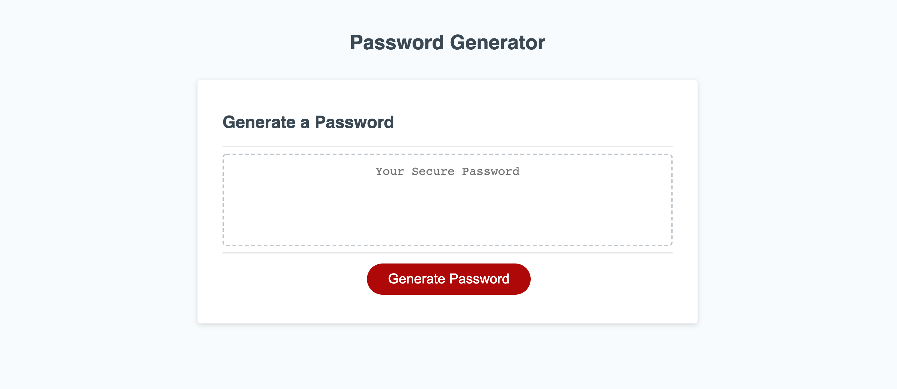

# Password Generator

[For deployed version, click me](https://jlentz17.github.io/passwordGenerator/)

For week three of bootcamp, I was given the assignment of making a random password generator with JavaScript. The project came with a front end already built with CSS 3 and HTML 5, and looks like this:

<<<<<<< HEAD

=======

>>>>>>> 50c95a3b69030822a124568975ed2096224953a1

# Description 

## Built With

* [Visual Studio Code](https://code.visualstudio.com/)
* [JavaScript](https://developer.mozilla.org/en-US/docs/Web/JavaScript)
* [CSS 3](https://developer.mozilla.org/en-US/docs/Web/CSS)
* [HTML 5](https://developer.mozilla.org/en-US/docs/Web/Guide/HTML/HTML5)
* [Markdown]

## Contributors

<<<<<<< HEAD
-Jeremy Lentz   <jlentz17@gmail.com>   &copy; 2020 Jeremy Lentz. All rights reserved.
=======
-Jeremy Lentz   <jlentz17@gmail.com>   &copy; 2020 Jeremy Lentz. All rights reserved.

>>>>>>> 50c95a3b69030822a124568975ed2096224953a1
